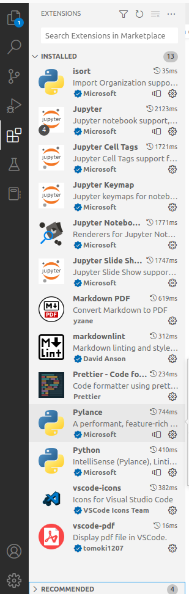
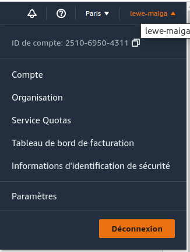
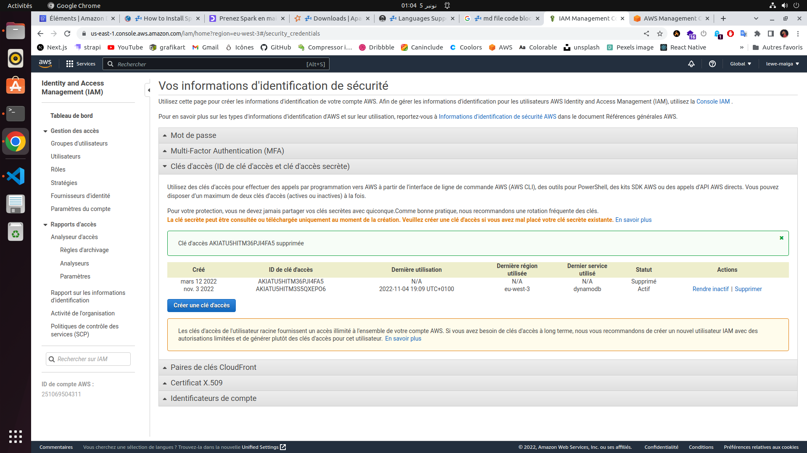

# Configuration d'une liaison entre une Base de donnée NoSQL DynamoBb Dynanmo

1. [Spark](#1---spark)
    - [Installation de Spark](#11---installation)
    - [Configuration du framework](#)
2. [AWS](#aws)
    - [Installation de l'invité de commande AWS](#installation-de-linvité-de-commande-aws)
    - [Configuration de l'environnement AWS](#configuration-de-lenvironnement-aws)
3. [Developpement](#spark-au-service-de-la-data-science)

Avant de se lancer dans la connexion des differentes entites nous devons installez les outils dont nous avons besoin. Dans ce TP nous ne nous attarderons pas sur le framework Hadoop car nous ne l'utiliserons pas dans ce module mais pour decouverir l'installation de la version compatible avec Spark Referer vous au cours
NB: La version Hadoop doit etre >= 3

## 1 - Spark

Spark est le framework le plus populaire dans le calcul distribué il cree des clusters afin d'accelerer le traitement et faciliter l'execution.

### 1.1 - Installation du framework Spark

Pour ce pour ce projet j'utiliserai **wget** pour le telechargement des paquets. Si vous ne l'avez pas installez saisissez la commande suivante pour l'obtenir :

```bash
sudo apt install wget
```

Pour installer le framework nous devons installer nous avons besoin du **jdk** (Java Developpement Kit) pour ce faire ouvrez le terminal et executez la commande suivante :

```bash
# Installe le jdk par defaut en ce moment
sudo apt install default-jdkg
```

Une fois l'installation terminée vous pouvez verifier qu'il est correctement installé :

```bash
# version 11.0.16
java -version
```

Une fois ces elements sur notre machine nous pouvons proceder à l'installation du framework Spark. Pour executer une application Spark sur la machine il suffit de telecharger une version nous travaillerons avec la version 3.3.1 [telecharger](https://spark.apache.org/downloads.html)

```bash
mkdir code
cd code
wget https://www.apache.org/dyn/closer.lua/spark/spark-3.3.1/spark-3.3.1-bin-hadoop3.tgz
tar xvf spark-3.3.1-bin-hadoop3.tgz
mv spark-3.3.1-bin-hadoop3 spark
```

ensuite pour verifier que tout fontionne nous allons realiser le **wordcount** (Hello world du calcul distribué) qui utilise l'operation **MapReduce**

Creer le fichier <code class="file">wordcount.py</code> avec le contenu suivant :

```python
import sys
from pyspark import SparkContext

sc = SparkContext()
lines = sc.textFile(sys.argv[1])
word_counts = lines.flatMap(lambda line: line.split(' ')) \
                   .map(lambda word: (word, 1)) \
                   .reduceByKey(lambda count1, count2: count1 + count2) \
                   .collect()

for (word, count) in word_counts:
    print(word, count)

```

Creer egalement un fichier avec ces quelques lignes

```bash
echo "Sur mes cahiers d'écolier Sur mon pupitre et les arbres Sur le sable de neige J'écris ton nom" > text.txt
echo "Sur les pages lues Sur toutes les pages blanches Pierre sang papier ou cendre J'écris ton nom" >> text.txt
echo "Sur les images dorées Sur les armes des guerriers Sur la couronne des rois J'écris ton nom" >> text.txt
```

Vous pouvez alors compter le nombre d'occurrences de chaque mot dans le fichier <code class="file">text.txt</code>

```bash
./spark/bin/spark-submit ./wordcount.py ./text.txt
```

### Configuration de l'environnement de developpement

Une fois l'installation teminée nous devons configurer l'environnement dans lequel le projet sera develope

Commençons par recuperer le lien du jdk et de python (c'est d'autant plus simple lorsque vous avez anaconda installé sur votre machine)

```bash
readlink -f $(which java)
# pour recuperer le path python
which python
```

Installer L'IDE Vscode developper disponible dans le **Ubuntu Software** avec les extentions suivante



Vous serez inviter à telecharger jupypter afin de lancer le seuveur developpement via **pip** mais l'editeur s'occupe de tous vous devez simplement accepter le popup qui apparaitra à l'ecran

Ensuite modifions les variables d'environnement qui devrait ressembler à ceci

```bash
#remplacer la chaine par le chemin java
export JAVA_HOME="chemin java"
export PATH=$PATH:$JAVA_HOME/bin

#remplacer la chaine par le chemin spark
export SPARK_HOME="chemin spark"
export PATH=$PATH:$SPARK_HOME/bin

#remplacer la chaine par le chemin python
export PYSPARK_PYTHON="chemin python"
export PYSPARK_DRIVER_PYTHON=code
export PYSPARK_DRIVER_PYTHON_OPTS=notebook
```

Pour finir valider les modifications apporter et lancer le serveur spark qui ouvrira l'editeur vscode

```bash
pyspark
```

ensuite lancer le serveur jupyter si l'editeur ne l'a pas fait

```bash
jupyter-notebook --no-browser
```

## AWS

Une fois l'environnement de developpement installé et fin prêt nous nous attaquons à present à la base de donnée DynamoDB, malgré le fait qu'il soit possible de l'installer localement ([consulter la documentation](https://docs.aws.amazon.com/amazondynamodb/latest/developerguide/DynamoDBLocal.html)) le moyen le plus simple serait de creer un compte AWS pour profiter du service gratuitement du moment qu'on ne depasse pas les limites imposées, sur ce procedons sans plus tarder à l'ouverture du compte

Rendez vous sur le [site oficiel](https://aws.amazon.com/fr/) et commencer l'inscription je suis sûr que vous pourrez vous debrouiller tout seul

NB: Vous devez reseigner vos informations bancaires mais ne vous inquietez pas vous n'en aurez pas besoin

Une fois l'inscription terminée, cliquez sur le nom d'utilisateur situé sur le coin en haut à droite de la plateforme



Ensuite acceder aux **informations d'identification de securite** dans la partie clés d'accès pour la generer. Vous devez telecharger cette clé car vous en aurez besoin



### Installation de l'invité de commande AWS

Une fois la clé en votre possession nous allons procedé à l'installation de l'invité de commande d'Amazon afin d'acceder aux services depuis le terminal.

```bash
# Valider les informations du profil
source ~/.profile

#Installer le cli à l'aide de pip
pip3 install awscli --upgrade --user

# Emplacement du cli
which aws

# Verifier la version du cli
aws --version
```

### Configuration de l'environnement AWS

L'installation de l'invité de commande terminée, configurons tous ça. Commençons par afficher le contenu de la clé

```bash
cat rootkey.csv
```

Nous sommes fin prêt pour debuter la configuration d' <code class="file">awscli</code>

```bash
aws configure
```

Selon votre localisation géographique, choisissez <code class="file">eu-west-1</code> (Europe ou Afrique),<code class=file>us-east-1</code>,<code class="file">us-west-1</code> ou <code class="file">ap-southeast-1</code> comme nom de région. Utilisezjsoncomme "Default output format", ce qui indique que vous souhaitez obtenir des réponses de l'API au format JSON.

Vous pouvez vérifier queawscliest bien configuré en exécutant
<code class="file">aws s3 ls</code> qui devrait répondre... rien du tout ! (pas de message d'erreur en tout cas)

Installer aussi <code class="file">boto3</code> qui est le sdk d'AWS pour python

```bash
pip install boto3
```

Ok, vous êtes équipés pour interagir avec les sevices sur AWS. C'est parti !

```
pyspark && jupyter-notebook --no-browser
```

L'environnement de travail est prêt, à present clonez le projet

```bash
git clone https://github.com/lewe-maiga/spark-and-dynamodb.git
```
